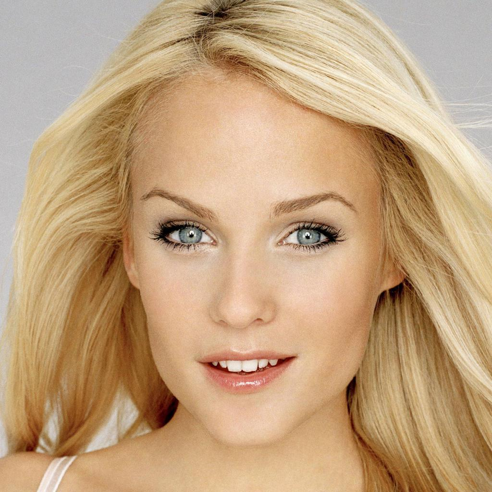

# Synthesizing High-Quality Face Images from Segmentation Maps or Sketches

This project implements an advanced image-to-image translation framework based on the pixel2style2pixel (pSp) approach. It demonstrates how to generate realistic face images from segmentation maps and sketches using a pre-trained StyleGAN generator along with a dedicated encoder.

## Project Overview

- **Objective:**  
  Learn and apply GAN-based techniques to synthesize high-quality face images from incomplete inputs such as segmentation maps and hand-generated sketches.

- **Approach:**  
  The project leverages an encoder that extracts style vectors from input images. These vectors are then combined with a random noise component and fed into a StyleGAN generator to produce a photorealistic output.

- **Datasets:**  
  The CelebAMask-HQ dataset is used for generating segmentation masks and creating a custom sketch dataset, ensuring the model is trained on diverse facial features.

- **Reference Paper:**  
  For detailed methodology, refer to the pixel2style2pixel (pSp) paper included in the project documentation.

## Key Visuals

- **Segmentation Masks:**  
  Illustrates how segmentation maps are created from the CelebAMask-HQ dataset.  
  

- **Results:**  
  Shows examples of the synthesized face images obtained from the model.  
  

- **Generating Sketch Dataset:**  
  Displays an original image alongside its corresponding sketch, demonstrating the process used for sketch generation.  
  - Original Image:   
  - Sketch: 

- **Loss Graphs:**  
  Visual representations of the training performance:
  - **Segmentation-to-Image Training Loss:**  
    
  - **Sketch-to-Face Training and Testing Losses:**  
      
    

- **Model Architecture:**  
  Diagram of the pSp framework showcasing the encoder and the StyleGAN generator integration.  
  

## How to Use

1. **Review the Documentation:**  
   Read the provided PDF report for a detailed explanation of the methodology, training details, and experimental results.
   
2. **Explore the Images:**  
   Check the `images` folder to view the referenced visuals which illustrate the dataset preparation, training progress, and model architecture.
   
3. **Reference Materials:**  
   Use the included references to the CelebAMask-HQ dataset and the pixel2style2pixel paper for additional context and further reading.

---

This repository contains the complete project report, along with this README and all related images. It serves as a concise guide to understanding the approach and outcomes of synthesizing face images from segmentation maps or sketches using state-of-the-art GAN techniques.
